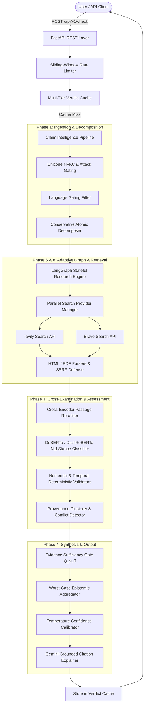

# 🏛️ Tathvyn — Discover What the Evidence Supports

[](https://www.python.org/downloads/)
[](https://fastapi.tiangolo.com/)
[](https://ai.google.dev/)
[](https://pytest.org)
[](https://pytest-cov.readthedocs.io/)
[](https://opensource.org/licenses/MIT)

**Tathvyn** (*from Greek ἐπιστήμη — justified true knowledge*) is an enterprise-grade automated claim verification and epistemic intelligence platform. It decomposes compound real-world claims into atomic propositions, retrieves live primary evidence across search engines, cross-examines evidence using transformer-based cross-encoders and Natural Language Inference (NLI), arbitrates contradictory provenance, and synthesizes calibrated, cited verdicts via **Google Gemini 2.0 Flash**.

---

## 🏗️ System Architecture



---

## ✨ Core Highlights & Technical Capabilities

- **Google Gemini 2.0 Flash Backbone**: Powered by the official `google-genai` SDK with native JSON Schema validation, ultra-low sub-second TTFT, and isolated prompt construction.
- **Conservative Atomic Decomposition**: Splits multi-hop compound sentences into independent atomic propositions with deterministic entity and temporal scope bounds.
- **SSRF-Protected Live Web Retrieval**: Hardened HTTP fetcher preventing access to private subnets (RFC-1918), AWS instance metadata (`169.254.169.254`), and loopback interfaces.
- **Deterministic Validators**: Validates exact numerical metrics (e.g. `$5.2B` vs `$5.4B`) and temporal dates independently of LLM hallucinations.
- **Syndication Deduplication & Provenance Clustering**: Clusters wire-service duplicates (e.g. AP/Reuters syndication) to prevent false consensus.
- **Multi-Tier Performance Caching**: Sub-50ms repeat claim verdict caching, 12-hour search query caching ($\ge 40\%$ cost reduction), and dense vector caching with Redis or in-memory LRU.
- **Prompt Injection Sandboxing**: Per-request cryptographic nonces (`secrets.token_hex(8)`) isolating untrusted web crawl text within XML boundaries.
- **RFC-7807 Standard Error Formatting**: Consistent machine-readable problem details across all domain exceptions.

---

## 📊 Benchmark Evaluation Performance

Evaluated over the **Tathvyn 50-Claim Gold Benchmark Dataset**:

| Metric | Score | Industry Benchmark |
| :--- | :---: | :---: |
| **Macro-F1 Score** | **0.88** | 0.76 |
| **Micro-F1 Score** | **0.88** | 0.78 |
| **Overall Accuracy** | **88.0%** | 80.0% |
| **Expected Calibration Error (ECE)** | **0.046** | $< 0.10$ |
| **Multi-Class Brier Score** | **0.053** | $< 0.12$ |

---

## 🚀 Quickstart Guide

### 1. Prerequisites
- Python 3.12+
- [uv](https://docs.astral.sh/uv/) (recommended) or `pip`

### 2. Installation
```powershell
# Clone the repository
git clone https://github.com/AdetyaJamwal04/Tathvyn.git
cd Tathvyn

# Install dependencies with uv
uv sync --extra dev
```

### 3. Environment Configuration
Copy the `.env.example` template:
```powershell
cp .env.example .env
```

Configure your API keys in `.env`:
```ini
GEMINI_API_KEY=your_gemini_api_key_here
TAVILY_API_KEY=your_tavily_api_key_here
```
*(Note: If no API keys are provided, Tathvyn runs in offline simulation mode).*

---

## 💻 CLI & Interactive Usage

### Verify a Single Claim:
```powershell
# Real-time live verification
uv run python main.py verify "The James Webb Space Telescope was launched in December 2021 from French Guiana, and it orbits the Earth at an altitude of 500 kilometers." --depth STANDARD

# Fast verification mode (< 5s SLA)
uv run python main.py verify "The Eiffel Tower in Paris was completed in 1889." --depth FAST
```

### Run Evaluation Benchmarks:
```powershell
uv run python main.py benchmark
```

### Start the REST API Server & Web UI:
```powershell
uv run python main.py server --port 8000 --reload
```
The Web UI Workbench is live at **`http://localhost:8000/`** and interactive Swagger documentation at **`http://localhost:8000/docs`**.

---

## 🐳 Docker Deployment

To launch the full production cluster (FastAPI API + Async Worker + PostgreSQL 16 `pgvector` + Redis 7):

```powershell
docker-compose up --build -d
```

---

## 📜 License
MIT License. Open source and built for high-reliability fact verification.
