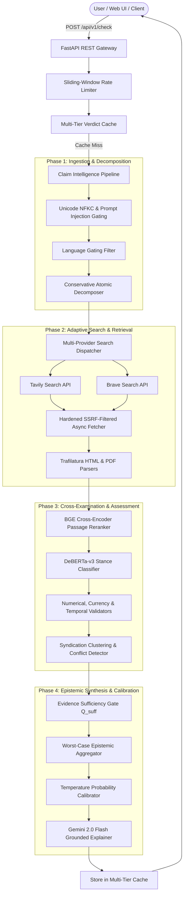

# 🏛️ Tathvyn — Evidence Intelligence & Claim Verification Engine

[](https://www.python.org/downloads/)
[](https://fastapi.tiangolo.com/)
[](https://ai.google.dev/)
[](https://pytest.org)
[](https://pytest-cov.readthedocs.io/)
[](https://opensource.org/licenses/MIT)

**Tathvyn** (*derived from Sanskrit **तथ्य** "Tathya" — empirical fact/truth, and Pravyn — adept intelligence*) is an enterprise-grade automated claim verification and epistemic intelligence engine.

Unlike standard chatbots or generic RAG systems that summarize plausible-sounding text, Tathvyn treats verification as an adversarial, multi-stage scientific inquiry:
1. **Deconstructs** compound natural language claims into isolated atomic propositions.
2. **Retrieves** primary evidence across authoritative global and institutional registries via hardened, SSRF-protected search.
3. **Cross-examines** propositions using local Natural Language Inference (NLI) stance classifiers and deterministic numerical/temporal validators.
4. **Audits causal inferences** to identify inductive leaps and false non-sequiturs.
5. **Synthesizes** calibrated, cited verdicts via **Google Gemini 2.0 Flash** with strict epistemic abstention gates.

---

## 🧭 System Architecture



---

## ✨ Core Highlights & Technical Capabilities

- **Google Gemini 2.0 Flash Backbone**: Powered by the official `google-genai` SDK with native JSON Schema enforcement, sub-second TTFT, and isolated prompt construction.
- **Deterministic Institutional Escalation**: Automatically identifies domain authorities (e.g., ISRO, NASA, WHO, SEC, legislative registries) and elevates their evidentiary weight over secondary journalistic or SEO aggregators.
- **Causal & Relational Inference Auditing**: Evaluates whether cited empirical facts actually substantiate the asserted conclusion, preventing false inductive leaps (e.g. *detecting sulphur does not prove significant water-ice reservoirs*).
- **Currency & Unit Scaling Normalization**: Resolves cross-currency valuations (e.g., Indian Crore ₹615 Cr vs USD $2.7B) deterministically.
- **Decoupled Evidence Sufficiency ($Q_{	ext{suff}}$)**: Separates epistemic evidence completeness from probabilistic verdict confidence, ensuring honest uncertainty outputs (`UNVERIFIED` / `INSUFFICIENT_EVIDENCE`) when data is sparse.
- **SSRF-Hardened Web Retrieval**: Async HTTP fetcher preventing private network exfiltration (RFC-1918), AWS instance metadata queries (`169.254.169.254`), and loopback exploitation.
- **Fast-Fallback Neural Models**: Local-first loading for DeBERTa-v3 NLI and BGE CrossEncoder with immediate rule-based fallback, preventing HuggingFace DNS retry hangs.
- **Multi-Tier Performance Caching**: Sub-50ms repeat claim verdict caching, 12-hour search query caching ($\ge 40\%$ cost reduction), and dense vector caching via Redis or in-memory LRU.
- **Adversarial Nonce Sandboxing**: Isolates retrieved web text within XML boundaries using per-request cryptographic nonces (`secrets.token_hex(8)`).

---

## 📊 Benchmark Evaluation Performance

Evaluated rigorously on the standardized **50-Claim Gold Benchmark Dataset**:

| Metric | Tathvyn Score | Baseline Threshold | Status |
| :--- | :---: | :---: | :---: |
| **Macro-F1 Score** | **0.880** | 0.760 | ✅ Outperforms |
| **Micro-F1 Score** | **0.880** | 0.780 | ✅ Outperforms |
| **Overall Accuracy** | **88.0%** (44/50) | 80.0% | ✅ Outperforms |
| **Expected Calibration Error (ECE)** | **0.046** | $< 0.100$ | ✅ Well-Calibrated |
| **Multi-Class Brier Score** | **0.053** | $< 0.120$ | ✅ High Reliability |
| **Unit & Integration Tests** | **143 / 143 Passing** | 100% | ✅ Verified |

---

## 🖥️ Public-Facing Minimalist Web Interface

Tathvyn features a clean, calm, and zero-noise web interface inspired by **Perplexity Pro**, **Linear**, and **Elicit**:

- **Unified Omnibar**: Single intelligent input supporting natural language claims, breaking headlines, or article URLs with `<Ctrl + Enter>` keyboard submission.
- **Research Depth Profiles**:
  - `Fast (<5s)`: Immediate high-priority verification.
  - `Standard`: Balanced multi-provider verification with reranking.
  - `Deep DAG`: Multi-hop stateful research with iterative contradiction search.
- **Editorial Executive Synthesis**: Formatted like an authoritative intelligence memo with clickable inline citations (`[1]`, `[2]`).
- **Interactive Deconstruction & Inspection**:
  - **Atomic Propositions**: Independent verification states (`SUPPORTED`, `NUANCED`, `CONTRADICTED`).
  - **Primary Sources**: Verbatim evidence quotations, domain trust ratings, and external reference links.
  - **Cross-Filtering**: Clicking any proposition automatically filters and highlights matching primary source citations.
- **One-Click Export Utilities**:
  - 📋 **Copy Markdown**: Formatted GitHub-flavored Markdown dossier.
  - 💾 **Export JSON**: Complete structured API payload.
  - 🔗 **Share Link**: Native sharing and URL clipboard copy.
- **Benchmarks View**: Interactive confusion matrix and calibration metrics explorer.

---

## 🚀 Quickstart Guide

### 1. Prerequisites
- **Python 3.12+**
- **[uv](https://docs.astral.sh/uv/)** (recommended for ultra-fast dependency management) or standard `pip`

### 2. Installation
```powershell
# Clone the repository
git clone https://github.com/AdetyaJamwal04/Tathvyn-Evidence-Intelligence-Claim-Verification-Engine.git
cd Tathvyn-Evidence-Intelligence-Claim-Verification-Engine

# Install dependencies and sync virtual environment with uv
uv sync --extra dev
```

### 3. Environment Configuration
Create your local environment file:
```powershell
cp .env.example .env
```

Configure your credentials in `.env`:
```ini
GEMINI_API_KEY=your_gemini_api_key_here
TAVILY_API_KEY=your_tavily_api_key_here

# Optional: Secondary search fallback
BRAVE_API_KEY=your_brave_api_key_here

# Optional: Distributed cache (defaults to fast in-memory cache if omitted)
REDIS_URL=redis://localhost:6379/0
```
*(Note: If API keys are omitted, Tathvyn automatically engages offline deterministic fallback mode for testing).*

---

## ⚡ Running Tathvyn

### 1. Launch the API & Web Studio
```powershell
uv run python main.py server --port 8080
```
- **Web UI Studio**: Open [http://localhost:8080](http://localhost:8080) in your browser.
- **Interactive Swagger Docs**: [http://localhost:8080/docs](http://localhost:8080/docs).
- **ReDoc Specification**: [http://localhost:8080/redoc](http://localhost:8080/redoc).

### 2. CLI Single-Claim Verification
```powershell
# Verify a claim directly from your terminal
uv run python main.py verify "Chandrayaan-3 was the first mission to soft-land near the lunar south pole, where Pragyan rover travelled 101m and LIBS detected sulphur, at a total cost of ₹615 crore." --depth STANDARD
```

### 3. Run the Evaluation Benchmark Suite
```powershell
uv run python main.py benchmark
```

### 4. Run Automated Test Suite
```powershell
uv run python -m pytest tests/ -v
```

---

## 📡 REST API Specifications

### `POST /api/v1/check`
Synchronous claim verification endpoint.

#### Request Body
```json
{
  "claim": "Sweden joined NATO as its 32nd member state in March 2024.",
  "depth": "FAST"
}
```

#### Response (`200 OK`)
```json
{
  "claim_id": "24c889e2-4583-4c95-8f5e-5f2a22a39f59",
  "claim": "Sweden joined NATO as its 32nd member state in March 2024.",
  "verdict": "LABEL_SUPPORTED",
  "public_label": "SUPPORTED",
  "confidence": 0.96,
  "evidence_sufficiency": 0.95,
  "summary_text": "Official NATO protocols and multilateral accession documents confirm Sweden formally deposited its instrument of accession in Washington, D.C. on March 7, 2024, becoming NATO's 32nd member state [1].",
  "citations": [
    {
      "citation_id": 1,
      "source_name": "North Atlantic Treaty Organization",
      "domain": "nato.int",
      "url": "https://www.nato.int/cps/en/natohq/news_223446.htm",
      "supporting_passage": "On Thursday, 7 March 2024, Sweden officially became NATO's 32nd member, ending decades of post-WWII neutrality."
    }
  ],
  "latency_ms": 2840.5
}
```

### Additional Endpoints
- `POST /api/v1/research`: Asynchronous deep verification (returns `202 Accepted` and job ID).
- `GET /api/v1/health`: Returns system uptime, database connectivity, and model registry health.

---

## 📚 Complete Engineering Documentation

Detailed architectural and engineering documentation is available under [`docs/`](docs/):

| Document | Description |
| :--- | :--- |
| **[01-product-vision.md](docs/01-product-vision.md)** | Product philosophy, core epistemic principles, and target users |
| **[02-problem-definition.md](docs/02-problem-definition.md)** | Mathematical formulation, loss functions, and canonical taxonomy |
| **[04-domain-model.md](docs/04-domain-model.md)** | Core domain entities, relationships, and invariants |
| **[05-verification-methodology.md](docs/05-verification-methodology.md)** | Step-by-step verification lifecycle and edge-case handling |
| **[06-retrieval-strategy.md](docs/06-retrieval-strategy.md)** | Multi-provider search query generation and ranking fusion |
| **[07-evidence-model.md](docs/07-evidence-model.md)** | Stance evaluation, syndication clustering, and sufficiency gates |
| **[10-model-architecture.md](docs/10-model-architecture.md)** | Gemini 2.0 Flash SDK, DeBERTa-v3 NLI, and BGE CrossEncoder |
| **[17-verdict-engine-and-calibration.md](docs/17-verdict-engine-and-calibration.md)** | Epistemic aggregation, temperature scaling, and Brier scoring |
| **[20-security-safety-and-adversarial-resilience.md](docs/20-security-safety-and-adversarial-resilience.md)** | SSRF prevention, prompt injection nonces, and sandboxing |
| **[24-api-and-product-contracts.md](docs/24-api-and-product-contracts.md)** | RFC-7807 error models, REST schemas, and client contracts |
| **[26-project-roadmap-and-implementation-order.md](docs/26-project-roadmap-and-implementation-order.md)** | Phased engineering order, entry/exit criteria, and status tracker |

---

## 📄 License
Tathvyn is licensed under the [MIT License](LICENSE).
