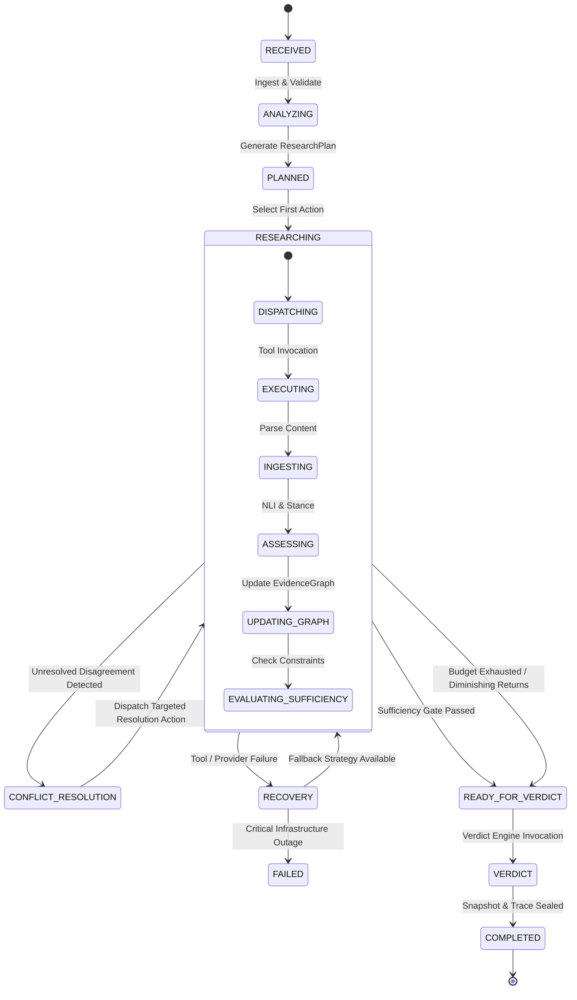

# Tathvyn — Research Orchestrator (Control Plane Specification)

## 1. Purpose & System Role

The **Research Orchestrator** is the central control plane of Tathvyn. It converts the verification process from a rigid, one-shot retrieval pipeline into an **adaptive, hypothesis-driven sequential decision process**.

```text
Static Pipeline (Insufficient):
Claim → Search Queries → Retrieve Top-K → NLI Stance → Verdict

Adaptive Agent (Tathvyn Orchestrator):
Claim → Plan → Execute Action → Ingest Evidence → Assess Gaps & Conflicts → Decide Next Action → Stop → Verdict
```

The orchestrator’s core mandate is:
> **Determine the highest-expected-value next research action to maximize evidence sufficiency and minimize epistemic uncertainty under explicit cost and latency constraints.**

The orchestrator does not perform model training or direct HTML scraping; it coordinates specialized tools, manages execution budgets, evaluates stopping conditions, and maintains the serializable research trace.

---

## 2. Epistemic Control Principles

### Principle 1 — Expected Information Gain Over Volume
A research action is valuable only if it has a non-zero probability of shifting the evidence state, resolving an ambiguous entity, confirming/refuting a numerical parameter, or surfacing a primary contradiction. Retrieving redundant derivative articles from the same provenance cluster yields zero information gain and must be pruned.

### Principle 2 — Mandatory Contradiction Search (Anti-Confirmation Bias)
When an initial research pass yields strong supporting evidence, the orchestrator MUST NOT terminate immediately. It is required to execute at least one targeted contradiction retrieval action:
$$\text{Query}_{\text{contra}} = f_{\text{negate}}(\text{Claim}) \cup f_{\text{counter}}(\text{Entities, Predicate})$$

### Principle 3 — Primary Source Escalation
If material claims are supported solely by secondary reporting, the orchestrator must attempt primary-source discovery (official government repositories, legal registries, scientific DOIs, corporate SEC filings) before concluding.

### Principle 4 — Separation of Operational Failure from Epistemic Uncertainty
If a search provider times out, returns HTTP 429, or fails to fetch a document, the orchestrator records an operational failure. It MUST NEVER treat an operational retrieval failure as evidence that the claim is false.

---

## 3. Orchestrator State Machine

The orchestrator manages verification requests through an explicit, auditable finite state machine (FSM):



### State Definitions & Transition Criteria

| State | Entry Condition | Action Performed | Next State(s) |
|---|---|---|---|
| `RECEIVED` | Client submits verification request | Authenticate, assign `verification_id`, enforce rate limits | `ANALYZING`, `FAILED` |
| `ANALYZING` | Valid input payload | Detect language, extract entities/time, decompose compound claim | `PLANNED`, `UNVERIFIABLE` |
| `PLANNED` | Valid `ClaimAnalysis` generated | Initialize `ResearchState`, allocate budget units per atomic claim | `RESEARCHING` |
| `RESEARCHING` | Actions pending & budget remaining | Select next optimal action, execute provider calls, ingest evidence | `RESEARCHING`, `CONFLICT_RESOLUTION`, `READY_FOR_VERDICT`, `RECOVERY` |
| `CONFLICT_RESOLUTION` | Direct contradiction detected between independent sources | Generate targeted disambiguation queries (temporal, scope, metric) | `RESEARCHING` |
| `RECOVERY` | Network timeout, rate limit (429), parse crash | Trigger exponential backoff, swap provider, or degrade depth | `RESEARCHING`, `FAILED` |
| `READY_FOR_VERDICT` | Sufficiency passed OR budget exhausted | Seal `EvidenceSnapshot`, freeze mutable state, call Verdict Engine | `VERDICT` |
| `VERDICT` | Evidence snapshot finalized | Run deterministic checks, aggregate atomic verdicts, calibrate confidence | `COMPLETED` |
| `COMPLETED` | Verdict & citations generated | Write immutable record to database, return API response | `[*]` |

---

## 4. Research State Data Model

The `ResearchState` object represents the full epistemic and operational context. It is strictly serializable to JSON/PostgreSQL.

```python
class ResearchState(BaseModel):
    verification_id: str
    claim_id: str
    raw_claim: str
    normalized_claim: str
    is_atomic: bool
    atomic_claims: list[AtomicClaim]
    
    # Execution Tracking
    status: ResearchStateStatus
    current_iteration: int
    max_iterations: int
    
    # Epistemic Containers
    evidence_graph: EvidenceGraph
    provenance_clusters: list[ProvenanceGroup]
    unresolved_conflicts: list[Conflict]
    coverage_matrix: dict[str, AtomicClaimCoverage]
    
    # Action Logs & Trace
    completed_actions: list[ActionExecutionRecord]
    pending_actions: list[ResearchAction]
    failed_actions: list[ActionFailureRecord]
    
    # Resource Accounting
    budget: ResearchBudget
    budget_consumed: BudgetConsumption
    
    # Termination
    stop_reason: Optional[ResearchStopReason] = None
    created_at: datetime
    updated_at: datetime
```

---

## 5. Action Space & Tool Abstraction

The orchestrator selects actions from a closed, typed action space:

```text
Action Types:
├── SEARCH_SUPPORT          # Broad retrieval for affirming evidence
├── SEARCH_CONTRADICTION    # Targeted retrieval for refutation / falsification
├── SEARCH_PRIMARY          # Domain-filtered search for original decree/paper/filing
├── SEARCH_TEMPORAL         # Date-bounded search for historical or current state
├── SEARCH_NUMERICAL        # Exact-metric and unit-normalized queries
├── SEARCH_ENTITY           # Knowledge graph / registry lookup for ambiguous entity
├── FETCH_DOCUMENT          # Full HTML/PDF download and parsing for candidate URL
├── FOLLOW_CITATION         # Extract DOI/URL references from an ingested document
├── RESOLVE_CONFLICT        # Specific comparative query between conflicting sources
└── STOP                    # Terminate research and hand off to Verdict Engine
```

### Tool Interface Contract

```python
class ResearchTool(ABC):
    name: str
    capability: ToolCapability
    cost_per_call: Decimal
    average_latency_ms: int

    @abstractmethod
    async def execute(
        self, 
        action: ResearchAction, 
        context: ResearchState
    ) -> ToolExecutionResult:
        pass
```

---

## 6. Action Selection Optimization Algorithm

At each iteration $t$, the orchestrator observes state $S_t$, constructs candidate actions $A(S_t)$, and selects the optimal action $a^*$:

$$a^* = \arg\max_{a \in A(S_t)} \frac{\text{EIG}(a \mid S_t) \cdot \text{Materiality}(\text{target}(a))}{\text{Cost}(a) + \gamma \cdot \text{Latency}(a)}$$

Where:
- $\text{EIG}(a \mid S_t)$: **Expected Information Gain**, calculated based on current coverage gaps, source quality deficits, and conflict ambiguity:
  $$\text{EIG}(a) = w_1 \cdot \Delta\text{Coverage} + w_2 \cdot \Delta\text{ContradictionConfidence} + w_3 \cdot \Delta\text{PrimarySourceStatus}$$
- $\text{Materiality}(\text{target})$: Priority weight of the targeted atomic claim (`CRITICAL` = 1.0, `MATERIAL` = 0.6, `CONTEXTUAL` = 0.2).
- $\text{Cost}(a)$: Estimated monetary API cost.
- $\text{Latency}(a)$: Expected network/inference latency in seconds, scaled by penalty parameter $\gamma$.

### Action Selection Decision Tree

```text
1. Are all material atomic claims covered with >= 1 independent source?
   ├── NO  → Select SEARCH_SUPPORT for highest-priority uncovered atomic claim.
   └── YES → Proceed to step 2.

2. Has contradiction search been performed for all supported atomic claims?
   ├── NO  → Select SEARCH_CONTRADICTION for strongest supported claim.
   └── YES → Proceed to step 3.

3. Are any material claims supported ONLY by derivative / secondary sources?
   ├── YES → Select SEARCH_PRIMARY with official domain constraints.
   └── NO  → Proceed to step 4.

4. Are there unresolved direct conflicts between high-quality sources?
   ├── YES → Select RESOLVE_CONFLICT (targeted scope/time comparison).
   └── NO  → Proceed to step 5.

5. Has evidence sufficiency threshold been satisfied across all material claims?
   ├── YES → Emit STOP(reason=SUFFICIENT_EVIDENCE).
   └── NO  → If Budget Remaining > Min Action Cost:
                 Select SEARCH_SUPPORT with relaxed query variants.
             Else:
                 Emit STOP(reason=BUDGET_EXHAUSTED).
```

---

## 7. Evidence Sufficiency Scoring Model

Evidence sufficiency $Q_{\text{suff}}(S)$ is a normalized scalar $[0, 1]$ evaluated over all material atomic claims:

$$Q_{\text{suff}} = \min_{c \in \text{Claims}_{\text{crit}}} \left[ 0.35 \cdot \text{Cov}(c) + 0.25 \cdot \text{Indep}(c) + 0.20 \cdot \text{Qual}(c) + 0.20 \cdot \text{ContraCov}(c) \right]$$

### Sufficiency Thresholds by Product Mode:
- **`FAST` Mode**: $Q_{\text{suff}} \ge 0.65$ (Allows termination with strong secondary source + basic contradiction check).
- **`STANDARD` Mode**: $Q_{\text{suff}} \ge 0.82$ (Requires at least 2 independent provenance clusters and explicit contradiction verification).
- **`DEEP` Mode**: $Q_{\text{suff}} \ge 0.92$ (Mandates primary source retrieval for official/numerical claims and complete conflict resolution).

---

## 8. Budget Accounting & Enforcement

The orchestrator enforces hard upper bounds on all resource dimensions:

```python
class ResearchBudget(BaseModel):
    max_iterations: int = 5
    max_search_queries: int = 12
    max_document_fetches: int = 8
    max_llm_tokens: int = 16000
    max_wall_time_seconds: float = 25.0
    max_estimated_cost_usd: Decimal = Decimal("0.05")
```

### Hard Budget Invariant:
If any resource reaches $100\%$ consumption:
1. All pending non-essential network actions are aborted.
2. In-flight extraction/NLI processes are allowed to complete.
3. The orchestrator immediately transitions to `READY_FOR_VERDICT` with stop reason `BUDGET_EXHAUSTED`.
4. The Verdict Engine accounts for budget exhaustion by penalizing confidence and applying abstention ceilings.

---

## 9. Parallel vs. Sequential Action Dispatching

To minimize end-to-end latency without violating rate limits or budget safety:

### Independent Parallel Actions (Batch Dispatch):
- Searching support, contradiction, and primary sources across independent atomic claims runs concurrently via `asyncio.gather()`.
- Document fetching across distinct domains runs concurrently up to `max_concurrent_fetches = 4`.

### Sequential Dependent Actions (Chained):
- Entity disambiguation MUST complete before executing entity-specific search queries.
- Search result URL extraction MUST complete before document fetching.
- Full text parsing MUST complete before passage segmentation and NLI scoring.

---

## 10. Failure Recovery & Provider Failover Matrix

| Failure Type | Immediate Recovery Strategy | Secondary Fallback | Final Action |
|---|---|---|---|
| **Search Provider Rate Limit (429)** | Switch to Secondary Provider (Brave Search) | Exponential backoff (500ms) | Skip query, record `PROVIDER_RATE_LIMIT` |
| **Search Provider 5xx / Outage** | Fail over instantly to secondary search provider | Retry once on backup provider | Mark query failed, proceed with partial evidence |
| **Document Fetch Timeout (>5s)** | Abort fetch, fall back to search snippet text | Mark document `FETCH_TIMEOUT` | Use snippet with reduced source confidence |
| **Paywalled / Blocked Document (403)** | Query archive / alternate syndicated URL | Discard document | Record rejection `PAYWALLED` |
| **NLI Local Model Crash / OOM** | Restart worker process, route pair to CPU fallback | Route inference to API LLM | Record `MODEL_INFERENCE_FAILED` |
| **Total Network Disconnection** | Abort research loop | Transition to `READY_FOR_VERDICT` | Return `INSUFFICIENT_EVIDENCE` (System Error) |

---

## 11. Traceability & Observability Contract

Every step taken by the orchestrator is appended to an immutable execution trace:

```json
{
  "step": 3,
  "timestamp": "2026-08-18T20:55:12.104Z",
  "action_type": "SEARCH_CONTRADICTION",
  "target_atomic_claim_id": "AC-002",
  "query_dispatched": "India real GDP growth 2024 NOT 8.2% dispute MoSPI",
  "provider": "Tavily",
  "latency_ms": 642,
  "cost_usd": 0.002,
  "results_count": 4,
  "new_evidence_items_yielded": 1,
  "rationale": "High support (0.94) achieved on AC-002; mandatory contradiction search triggered."
}
```

This trace is returned in administrative API responses and stored in PostgreSQL for offline evaluation and regression analysis.
