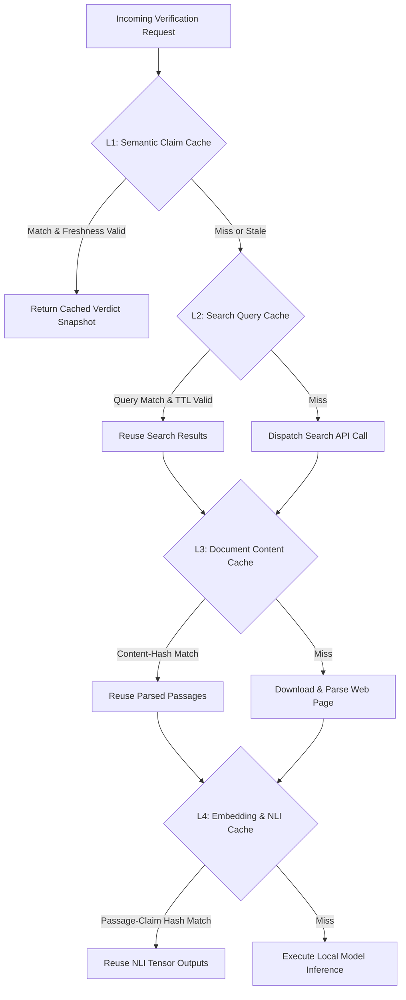
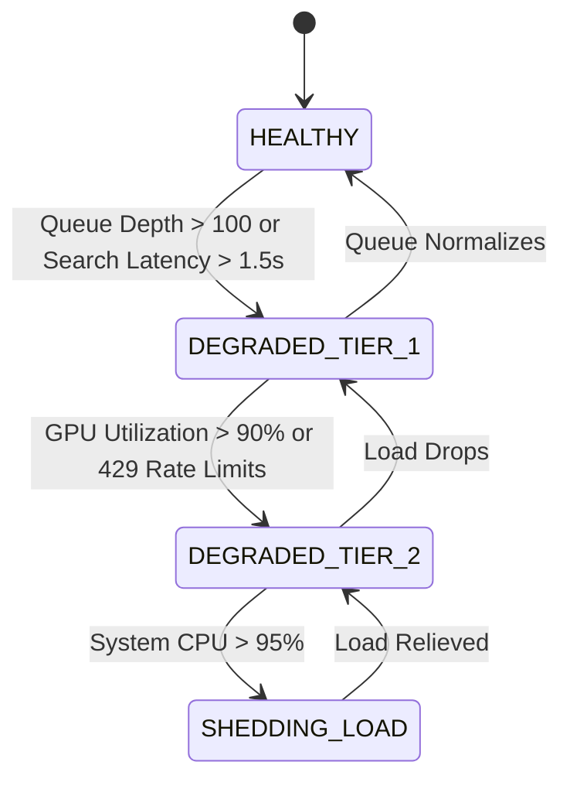

# Tathvyn — Cost, Latency, and Scale Engineering Specification

## 1. Purpose & Economics Objective

A fact verification system that achieves 99% accuracy at $5.00 per check is unusable for real-time web workflows. Conversely, a system that costs $0.0001 per check but hallucinates verdicts is actively dangerous.

Tathvyn optimizes for **Quality-Adjusted Verification Cost ($C_{\text{correct}}$)** and **Predictable Latency Profiles**:

$$C_{\text{correct}} = \frac{\mathbb{E}[C_{\text{request}}]}{P(\text{Verdict is Correct})}$$

This specification defines the mathematical cost models, latency budgets, batching strategies, caching hierarchies, and graceful degradation policies required to operate Tathvyn economically from 1 RPS to 1,000 RPS.

---

## 2. Comprehensive Request Cost Model

Every verification request accumulates resource costs across six distinct dimensions:

$$C_{\text{request}} = C_{\text{search}} + C_{\text{llm}} + C_{\text{local\_ml}} + C_{\text{network}} + C_{\text{storage}} + C_{\text{compute}}$$

### Detailed Cost Breakdown Matrix

| Cost Component | Pricing Metric (2026 Baseline) | Typical `FAST` Usage | Typical `STANDARD` Usage | Typical `DEEP` Usage |
|---|---|---|---|---|
| **$C_{\text{search}}$ (Tavily/Brave)** | $0.0010 / query | 1 query ($0.001) | 3 queries ($0.003) | 8 queries ($0.008) |
| **$C_{\text{llm}}$ (Claude 3.5 Sonnet)** | $3.00/M in, $15.00/M out | 0 tokens ($0.000) | 1.5k in / 400 out ($0.0105) | 6k in / 1.5k out ($0.0405) |
| **$C_{\text{local\_ml}}$ (DeBERTa + BGE)** | $0.00005 / inference (Compute) | 6 pairs ($0.0003) | 24 pairs ($0.0012) | 80 pairs ($0.0040) |
| **$C_{\text{network}}$ (Doc Scraping)** | $0.09 / GB bandwidth | 0.5 MB ($0.000045) | 2.0 MB ($0.00018) | 6.0 MB ($0.00054) |
| **$C_{\text{storage}}$ (PG + Redis)** | $0.15 / GB-month amortized | Negligible | Negligible | Negligible |
| **Total Estimated Cost** | — | **~$0.0013 / check** | **~$0.0148 / check** | **~$0.0530 / check** |

---

## 3. Latency Waterfall & Stage Budgets

Tathvyn enforces explicit wall-clock latency budgets per pipeline stage.

```text
Latency Waterfall (STANDARD Mode — Target < 3,500 ms p95):

[0-100ms]   ── Language Detection, Normalization & spaCy Entity Extraction (CPU)
[100-250ms] ── Query Generation & Claim Classification (Fast Rule / Cache / LLM)
[250-1200ms]── Concurrent Search Provider API Calls (Tavily / Brave I/O)
[1200-2000ms]─ Async Document Fetch & HTML/PDF Text Extraction (Parallel I/O)
[2000-2400ms]─ Passage Segmentation & BGE Dense Embedding (Local Batch)
[2400-2800ms]─ Cross-Encoder Reranking & DeBERTa NLI Stance Scoring (GPU/CPU Batch)
[2800-3100ms]─ Evidence Graph Construction & Verdict Engine Aggregation (Deterministic)
[3100-3400ms]─ Calibrated Explanation & Citation Assembly (LLM / Template)
```

### SLA Targets by Verification Mode

```text
Mode       | p50 Latency | p95 Latency | p99 Latency | Max Timeout Cap
───────────┼─────────────┼─────────────┼─────────────┼────────────────
FAST       | 850 ms      | 1,800 ms    | 2,500 ms    | 4,000 ms
STANDARD   | 2,200 ms    | 3,500 ms    | 4,800 ms    | 8,000 ms
DEEP       | 8,500 ms    | 16,000 ms   | 22,000 ms   | 30,000 ms (Async)
```

---

## 4. Multi-Tier Caching Architecture

Caching is the primary mechanism for decoupling request volume from external API costs. However, fact verification caching must respect **epistemic freshness**.



### Cache TTL Invalidation Policies

| Cache Tier | Key Format | Default TTL (Current Events) | Default TTL (Historical Facts) | Eviction Policy |
|---|---|---|---|---|
| **Claim Verdict** | `hash(claim + mode + policy_v)` | 2 hours | 30 days | Redis LRU |
| **Search Results** | `hash(query + provider)` | 1 hour | 14 days | Redis LRU |
| **Parsed Documents**| `hash(canonical_url + content_hash)` | 24 hours | 90 days | Object Storage |
| **Passage Embeddings**| `hash(passage_text + model_v)` | 180 days | 365 days | Postgres `pgvector` |
| **NLI Stance Pairs**| `hash(claim_text + passage_text)` | 30 days | 180 days | Redis Key-Value |

---

## 5. Local Model Batching & Hardware Optimization

To achieve high throughput on local ML inference without GPU memory thrashing:

### 5.1 Dynamic Micro-Batching
- Inbound embedding (`bge-small`) and NLI (`deberta-v3-large`) pairs are accumulated into dynamic micro-batches up to `batch_size = 32` or `max_wait_ms = 25ms`.
- Vector operations are compiled and executed via **ONNX Runtime** with TensorRT / DirectML acceleration.

### 5.2 Quantization & Memory Footprint
- Local models are served in **FP16** on CUDA GPUs (or **INT8 / ONNX** on CPU instances).
- Memory budget per worker instance:
  - `BAAI/bge-small-en-v1.5`: ~150 MB RAM
  - `BAAI/bge-reranker-v2-m3`: ~600 MB RAM
  - `microsoft/deberta-v3-large-mnli`: ~1.2 GB RAM
  - Total local model RAM: **< 2.5 GB**, fitting comfortably on commodity cloud instances.

---

## 6. Graceful Degradation Under Load

When system traffic exceeds available inference capacity or external search providers degrade:



### Graceful Degradation Action Matrix

| Degradation Tier | Trigger Condition | System Action | Epistemic Impact |
|---|---|---|---|
| **Tier 1 (Mild)** | Search latency spikes or Redis queue depth > 100 | Reduce max search queries per claim from 12 to 6; enable aggressive snippet-only ranking | Minimal; slightly reduced recall on obscure claims |
| **Tier 2 (Moderate)** | GPU queue delay > 500ms | Disable LLM conflict arbitration; route all stance scoring to local DeBERTa; downgrade `DEEP` requests to `STANDARD` | Explanation length shortened; confidence calibrated conservatively |
| **Tier 3 (Severe)** | System memory > 90% or external search outage | Serve cached verdicts where available; reject new `ASYNC_DEEP` jobs; execute `FAST` checks only | Zero false certainty; un-cached claims return `INSUFFICIENT_EVIDENCE` |

---

## 7. Cost & Latency Invariants

- **INV-CS-001**: Every completed verification record must track exact estimated cost and latency breakdown.
- **INV-CS-002**: No request shall exceed its configured budget ceiling under any circumstances.
- **INV-CS-003**: System overload must result in reduced research depth or controlled queueing, never corrupted truth verdicts.
- **INV-CS-004**: Cache hits must verify temporal freshness compatibility before reuse.
