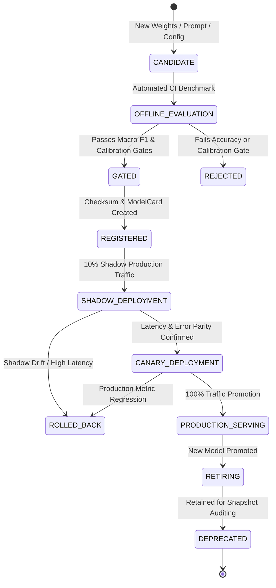
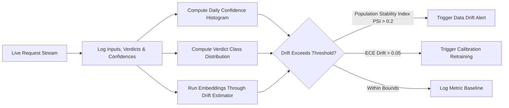

# Tathvyn — MLOps and Model Lifecycle Engineering Specification

## 1. Purpose & Core Philosophy

Tathvyn relies on a hybrid hierarchy of machine learning models:
1. **Local Neural Classifiers & Encoders**: Embeddings (`BGE`), Cross-Encoder Rerankers, NLI Stance Classifiers (`DeBERTa-v3`), and Named Entity Recognizers (`spaCy`).
2. **Deterministic NLP & Regex Parsers**: Date/interval extractors, numerical parsers, and unit normalizers.
3. **Hosted Large Language Models (LLMs)**: Claude 3.5 / GPT-4o for complex planning, deep conflict arbitration, and grounded explanation generation.

This specification establishes the **MLOps lifecycle, model registry governance, benchmark gating, continuous evaluation, and drift monitoring** systems.

The core MLOps invariant is:
> **No model weights, prompt templates, or inference configurations shall enter production without demonstrating zero regression against the standardized verification benchmark suite.**

---

## 2. Model Lifecycle State Machine



---

## 3. Model Registry Schema Specification

Every model artifact, whether local tensor weights or hosted API prompt configuration, must be registered in the PostgreSQL `model_registry` table:

```python
class ModelRegistryEntry(BaseModel):
    model_id: str                          # e.g. "nli-deberta-v3-large-v1"
    model_family: str                      # "DeBERTa", "BGE", "Claude", "spaCy"
    task: MLTaskType                       # NLI, EMBEDDING, RERANKING, NER, REASONING
    version: str                           # Semantic version "1.2.0"
    
    # Artifact Provenance
    artifact_uri: str                      # Local path or HuggingFace ID
    checksum_sha256: str                   # SHA256 of weight file or prompt template
    framework: str                         # "PyTorch", "ONNX", "Anthropic-API"
    quantization: str                      # "FP16", "INT8", "FP32", "None"
    
    # Runtime Requirements
    min_ram_mb: int
    gpu_required: bool
    target_device: str                     # "cuda", "cpu", "directml"
    max_batch_size: int
    
    # Verified Benchmark Metrics
    macro_f1: float
    expected_calibration_error: float
    p95_inference_latency_ms: float
    
    # Status & Governance
    status: ModelServingStatus             # REGISTERED, SHADOW, ACTIVE, DEPRECATED
    registered_at: datetime
    promoted_at: Optional[datetime]
    created_by: str
```

---

## 4. Benchmark Gating & Promotion Criteria

A model candidate must automatically satisfy the following threshold gates on the **Tathvyn Evaluation Suite ($N=250+$)** before staging or canary deployment:

```text
Gate Metric                       | Required Threshold      | Failure Action
──────────────────────────────────┼─────────────────────────┼─────────────────────────────
Macro-F1 Score                    | ≥ 0.88 across all 5 cls | Reject candidate immediately
Expected Calibration Error (ECE)  | ≤ 0.08                  | Block promotion; recalibrate
Adversarial Stance Robustness     | ≥ 0.85 on negation test | Reject candidate
p95 Inference Latency (Local)     | ≤ 150 ms per batch      | Reject; optimize quantization
GPU Memory Allocation             | ≤ 2,500 MB peak VRAM    | Reject; require smaller arch
Backward Snapshot Reproducibility | 100% trace match        | Flag breaking changes
```

---

## 5. Shadow & Canary Deployment Protocol

### 5.1 Shadow Deployment (Traffic Mirroring)
- 10% of incoming production requests are asynchronously mirrored to the candidate model worker.
- The candidate model's predictions, latency, and resource footprint are logged to the `shadow_eval_log` table without affecting the live user response.
- Metrics evaluated during shadow mode (minimum 24-hour observation window):
  - **Verdict Agreement Rate**: Must exceed 92% agreement with active production baseline.
  - **Error Rate**: Zero uncaught runtime exceptions or memory OOM events.

### 5.2 Canary Rollout Schedule

```text
Step 1:  5% Traffic Allocation ─── 4 Hours Observation
Step 2: 25% Traffic Allocation ─── 8 Hours Observation
Step 3: 50% Traffic Allocation ─── 12 Hours Observation
Step 4: 100% Full Promotion ────── Active Baseline Established
```

### 5.3 Automated Instant Rollback Triggers
The canary controller automatically reverts traffic to the previous active model version if:
1. Live error rate increases by $> 0.5\%$.
2. Latency p95 increases by $> 25\%$.
3. Sudden skew in verdict distribution (e.g. `INSUFFICIENT_EVIDENCE` rate spikes by $> 15\%$).

---

## 6. Model & Calibration Drift Monitoring

Tathvyn continuously computes drift metrics over a rolling 7-day window:



### Monitored Drift Dimensions:
1. **Input Domain Shift**: Tracking cosine drift of claim embedding centroids across domains (Politics, Health, Finance, Science).
2. **Confidence Distribution Skew**: Monitoring Kolmogorov-Smirnov (KS) statistic on predicted confidence scores.
3. **Abstention Rate Drift**: Tracking the proportion of requests resulting in `INSUFFICIENT_EVIDENCE`.

---

## 7. MLOps Invariants Checklist

- **INV-ML-001**: Every model weight file, prompt template, and heuristic rule set is versioned with an immutable SHA256 checksum.
- **INV-ML-002**: Historical verification snapshots record the exact model versions used to generate verdicts.
- **INV-ML-003**: No model promotion is permitted without automated benchmark gate verification.
- **INV-ML-004**: Rollback capability to the previous stable model version is guaranteed with zero downtime.
