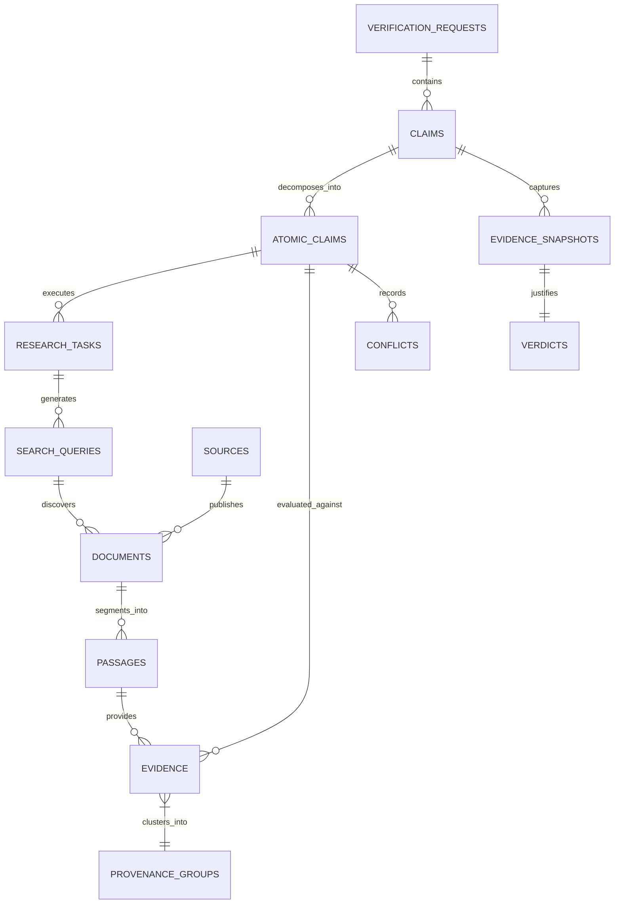

# Tathvyn — Data Schema, Storage, and Provenance Graph Specification

## 1. Purpose & Persistence Architecture

Tathvyn requires a persistent, auditable data store capable of satisfying two distinct workloads:
1. **High-Throughput Verification Engine Workloads**: Fast indexed lookups for claim deduplication, semantic vector searches over passages, and real-time state persistence.
2. **Epistemic Traceability & Auditability**: Permanent, immutable recording of historical evidence snapshots, provenance trees, model versions, and calibrated verdict decisions.

This document specifies the **relational PostgreSQL schema**, **`pgvector` embeddings integration**, **provenance graph representation**, and **immutable snapshot mechanics**.

---

## 2. Relational Schema Specification (PostgreSQL 16)



---

## 3. Detailed DDL Schema Definitions

```sql
-- Enable necessary extensions
CREATE EXTENSION IF NOT EXISTS "uuid-ossp";
CREATE EXTENSION IF NOT EXISTS "pgcrypto";
CREATE EXTENSION IF NOT EXISTS "vector";

-- 1. Verification Requests Table
CREATE TABLE verification_requests (
    request_id UUID PRIMARY KEY DEFAULT gen_random_uuid(),
    tenant_id VARCHAR(64) NOT NULL DEFAULT 'default',
    raw_input TEXT NOT NULL,
    mode VARCHAR(16) NOT NULL CHECK (mode IN ('FAST', 'STANDARD', 'DEEP')),
    status VARCHAR(24) NOT NULL CHECK (status IN ('QUEUED', 'RUNNING', 'COMPLETED', 'FAILED', 'TIMEOUT')),
    ip_address INET,
    client_metadata JSONB DEFAULT '{}'::jsonb,
    created_at TIMESTAMPTZ NOT NULL DEFAULT CURRENT_TIMESTAMP,
    completed_at TIMESTAMPTZ
);

-- 2. Claims Table
CREATE TABLE claims (
    claim_id UUID PRIMARY KEY DEFAULT gen_random_uuid(),
    request_id UUID NOT NULL REFERENCES verification_requests(request_id) ON DELETE CASCADE,
    raw_text TEXT NOT NULL,
    normalized_text TEXT NOT NULL,
    language_code VARCHAR(8) NOT NULL DEFAULT 'en',
    primary_type VARCHAR(32) NOT NULL,
    secondary_types TEXT[] DEFAULT '{}',
    domain VARCHAR(32) NOT NULL DEFAULT 'GENERAL',
    complexity VARCHAR(16) NOT NULL DEFAULT 'MODERATE',
    is_atomic BOOLEAN NOT NULL DEFAULT FALSE,
    content_hash VARCHAR(64) NOT NULL,
    created_at TIMESTAMPTZ NOT NULL DEFAULT CURRENT_TIMESTAMP
);

-- 3. Atomic Claims Table
CREATE TABLE atomic_claims (
    atomic_claim_id UUID PRIMARY KEY DEFAULT gen_random_uuid(),
    claim_id UUID NOT NULL REFERENCES claims(claim_id) ON DELETE CASCADE,
    sequence_order INT NOT NULL DEFAULT 0,
    text TEXT NOT NULL,
    is_atomic BOOLEAN NOT NULL DEFAULT TRUE,
    decomposition_depth INT NOT NULL DEFAULT 1,
    materiality VARCHAR(16) NOT NULL CHECK (materiality IN ('CRITICAL', 'MATERIAL', 'CONTEXTUAL')),
    entities JSONB DEFAULT '[]'::jsonb,
    temporal_scope JSONB DEFAULT '{}'::jsonb,
    status VARCHAR(24) NOT NULL DEFAULT 'UNRESEARCHED',
    created_at TIMESTAMPTZ NOT NULL DEFAULT CURRENT_TIMESTAMP
);

-- 4. Sources Table
CREATE TABLE sources (
    source_id UUID PRIMARY KEY DEFAULT gen_random_uuid(),
    canonical_domain VARCHAR(255) NOT NULL UNIQUE,
    publisher_name VARCHAR(255),
    source_type VARCHAR(32) NOT NULL,
    authority_class VARCHAR(16) NOT NULL CHECK (authority_class IN ('PRIMARY', 'SECONDARY', 'TERTIARY', 'DERIVATIVE', 'UNKNOWN')),
    domain_authority_score FLOAT CHECK (domain_authority_score BETWEEN 0.0 AND 1.0),
    country_code VARCHAR(4),
    metadata JSONB DEFAULT '{}'::jsonb,
    created_at TIMESTAMPTZ NOT NULL DEFAULT CURRENT_TIMESTAMP
);

-- 5. Documents Table
CREATE TABLE documents (
    document_id UUID PRIMARY KEY DEFAULT gen_random_uuid(),
    source_id UUID NOT NULL REFERENCES sources(source_id),
    url TEXT NOT NULL,
    canonical_url TEXT NOT NULL,
    content_hash VARCHAR(64) NOT NULL,
    title TEXT,
    author VARCHAR(255),
    published_at TIMESTAMPTZ,
    retrieved_at TIMESTAMPTZ NOT NULL DEFAULT CURRENT_TIMESTAMP,
    http_status INT,
    storage_uri TEXT,
    created_at TIMESTAMPTZ NOT NULL DEFAULT CURRENT_TIMESTAMP,
    CONSTRAINT uq_doc_url_hash UNIQUE (canonical_url, content_hash)
);

-- 6. Passages Table (With pgvector Embedding Index)
CREATE TABLE passages (
    passage_id UUID PRIMARY KEY DEFAULT gen_random_uuid(),
    document_id UUID NOT NULL REFERENCES documents(document_id) ON DELETE CASCADE,
    sequence_order INT NOT NULL,
    text TEXT NOT NULL,
    char_start INT NOT NULL,
    char_end INT NOT NULL,
    token_count INT NOT NULL,
    content_hash VARCHAR(64) NOT NULL,
    embedding vector(384), -- BGE-small embedding dimension
    created_at TIMESTAMPTZ NOT NULL DEFAULT CURRENT_TIMESTAMP
);

-- 7. Provenance Groups Table
CREATE TABLE provenance_groups (
    provenance_group_id UUID PRIMARY KEY DEFAULT gen_random_uuid(),
    root_source_id UUID REFERENCES sources(source_id),
    detection_method VARCHAR(32) NOT NULL,
    cluster_confidence FLOAT NOT NULL CHECK (cluster_confidence BETWEEN 0.0 AND 1.0),
    created_at TIMESTAMPTZ NOT NULL DEFAULT CURRENT_TIMESTAMP
);

-- 8. Evidence Table
CREATE TABLE evidence (
    evidence_id UUID PRIMARY KEY DEFAULT gen_random_uuid(),
    atomic_claim_id UUID NOT NULL REFERENCES atomic_claims(atomic_claim_id) ON DELETE CASCADE,
    passage_id UUID NOT NULL REFERENCES passages(passage_id),
    provenance_group_id UUID REFERENCES provenance_groups(provenance_group_id),
    relationship VARCHAR(32) NOT NULL CHECK (relationship IN (
        'SUPPORTS', 'PARTIALLY_SUPPORTS', 'CONTRADICTS', 
        'PARTIALLY_CONTRADICTS', 'QUALIFIES', 'CONTEXTUALIZES', 'NEUTRAL'
    )),
    relevance_score FLOAT NOT NULL CHECK (relevance_score BETWEEN 0.0 AND 1.0),
    entailment_score FLOAT NOT NULL CHECK (entailment_score BETWEEN 0.0 AND 1.0),
    contradiction_score FLOAT NOT NULL CHECK (contradiction_score BETWEEN 0.0 AND 1.0),
    source_quality_score FLOAT NOT NULL CHECK (source_quality_score BETWEEN 0.0 AND 1.0),
    independence_score FLOAT NOT NULL CHECK (independence_score BETWEEN 0.0 AND 1.0),
    temporal_validity_status VARCHAR(24) NOT NULL,
    assessment_version VARCHAR(32) NOT NULL,
    created_at TIMESTAMPTZ NOT NULL DEFAULT CURRENT_TIMESTAMP
);

-- 9. Conflicts Table
CREATE TABLE conflicts (
    conflict_id UUID PRIMARY KEY DEFAULT gen_random_uuid(),
    atomic_claim_id UUID NOT NULL REFERENCES atomic_claims(atomic_claim_id) ON DELETE CASCADE,
    evidence_id_a UUID NOT NULL REFERENCES evidence(evidence_id),
    evidence_id_b UUID NOT NULL REFERENCES evidence(evidence_id),
    conflict_type VARCHAR(32) NOT NULL,
    severity VARCHAR(16) NOT NULL CHECK (severity IN ('CRITICAL', 'MAJOR', 'MINOR')),
    resolution_status VARCHAR(32) NOT NULL DEFAULT 'UNRESOLVED',
    resolution_rationale TEXT,
    created_at TIMESTAMPTZ NOT NULL DEFAULT CURRENT_TIMESTAMP
);

-- 10. Evidence Snapshots Table
CREATE TABLE evidence_snapshots (
    snapshot_id UUID PRIMARY KEY DEFAULT gen_random_uuid(),
    claim_id UUID NOT NULL REFERENCES claims(claim_id) ON DELETE CASCADE,
    evidence_ids UUID[] NOT NULL,
    provenance_group_ids UUID[] NOT NULL,
    policy_version VARCHAR(32) NOT NULL,
    snapshot_checksum VARCHAR(64) NOT NULL,
    created_at TIMESTAMPTZ NOT NULL DEFAULT CURRENT_TIMESTAMP
);

-- 11. Verdicts Table
CREATE TABLE verdicts (
    verdict_id UUID PRIMARY KEY DEFAULT gen_random_uuid(),
    claim_id UUID NOT NULL REFERENCES claims(claim_id) ON DELETE CASCADE,
    snapshot_id UUID NOT NULL REFERENCES evidence_snapshots(snapshot_id),
    verdict VARCHAR(32) NOT NULL CHECK (verdict IN (
        'SUPPORTED', 'REFUTED', 'PARTIALLY_SUPPORTED', 'INSUFFICIENT_EVIDENCE', 'UNVERIFIABLE'
    )),
    public_label VARCHAR(32) NOT NULL CHECK (public_label IN (
        'LIKELY TRUE', 'LIKELY FALSE', 'PARTIALLY TRUE', 'UNVERIFIED', 'UNVERIFIABLE'
    )),
    framing_concerns BOOLEAN NOT NULL DEFAULT FALSE,
    confidence FLOAT NOT NULL CHECK (confidence BETWEEN 0.0 AND 1.0),
    evidence_sufficiency FLOAT NOT NULL CHECK (evidence_sufficiency BETWEEN 0.0 AND 1.0),
    stop_reason VARCHAR(32) NOT NULL,
    summary_text TEXT NOT NULL,
    citations JSONB NOT NULL DEFAULT '[]'::jsonb,
    engine_version VARCHAR(32) NOT NULL,
    calibration_version VARCHAR(32) NOT NULL,
    created_at TIMESTAMPTZ NOT NULL DEFAULT CURRENT_TIMESTAMP
);
```

---

## 4. Indexing & Query Optimization Strategy

```sql
-- Fast lookup for claim deduplication
CREATE INDEX idx_claims_content_hash ON claims(content_hash);

-- Fast lookup of atomic claims for a parent claim
CREATE INDEX idx_atomic_claims_claim_id ON atomic_claims(claim_id);

-- Vector Similarity Index (HNSW for Cosine Distance)
CREATE INDEX idx_passages_embedding_hnsw 
ON passages USING hnsw (embedding vector_cosine_ops)
WITH (m = 16, ef_construction = 64);

-- Evidence lookups per atomic claim
CREATE INDEX idx_evidence_atomic_claim ON evidence(atomic_claim_id);
CREATE INDEX idx_evidence_relationship ON evidence(relationship);

-- Fast document lookup by canonical URL
CREATE INDEX idx_documents_canonical_url ON documents(canonical_url);

-- Recent requests monitoring index
CREATE INDEX idx_verification_requests_created ON verification_requests(created_at DESC);
```

---

## 5. Provenance Graph Relational Representation

Rather than introducing an external graph engine in MVP, provenance relationships between documents are modeled via an adjacency table:

```sql
CREATE TABLE document_provenance_edges (
    edge_id UUID PRIMARY KEY DEFAULT gen_random_uuid(),
    source_doc_id UUID NOT NULL REFERENCES documents(document_id) ON DELETE CASCADE,
    target_doc_id UUID NOT NULL REFERENCES documents(document_id) ON DELETE CASCADE,
    relationship VARCHAR(32) NOT NULL CHECK (relationship IN (
        'DERIVED_FROM', 'CITES', 'QUOTES', 'DUPLICATES', 'QUALIFIES'
    )),
    confidence FLOAT NOT NULL CHECK (confidence BETWEEN 0.0 AND 1.0),
    detection_method VARCHAR(32) NOT NULL,
    created_at TIMESTAMPTZ NOT NULL DEFAULT CURRENT_TIMESTAMP,
    CONSTRAINT uq_prov_edge UNIQUE (source_doc_id, target_doc_id, relationship)
);

CREATE INDEX idx_prov_source ON document_provenance_edges(source_doc_id);
CREATE INDEX idx_prov_target ON document_provenance_edges(target_doc_id);
```

---

## 6. Immutable Snapshot Mechanics

When research completes and the Verdict Engine evaluates the evidence:
1. All relevant `evidence_id` and `provenance_group_id` UUIDs are compiled into sorted arrays.
2. A deterministic SHA256 checksum is calculated:
   $$\text{Checksum} = \text{SHA256}(\text{Sort}(\text{evidence\_ids}) \cup \text{policy\_version} \cup \text{model\_versions})$$
3. The `evidence_snapshots` record is inserted.
4. The generated `verdicts` record references `snapshot_id`.
5. Any subsequent update or re-verification generates a **new snapshot and verdict record**, preserving historical audit trails permanently.
