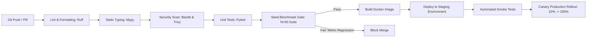

# Tathvyn — Deployment, CI/CD, and Production Readiness Specification

## 1. Purpose & Production Engineering Objectives

This document specifies the deployment topology, container packaging, automated CI/CD pipeline, database migration workflows, observability stack, and disaster recovery procedures required to run Tathvyn in production.

Production Goals:
- **Zero-Downtime Deployments**: Rolling updates for API servers and workers with clean connection draining.
- **Automated Quality Gates**: CI pipelines that enforce 100% type safety, linting, security scans, and benchmark regression prevention.
- **Fail-Safe Observability**: Comprehensive Prometheus metrics, structured OpenTelemetry traces, and actionable alerts.

---

## 2. Containerization Strategy (Docker)

Tathvyn employs multi-stage Docker builds to produce minimal, hardened production container images based on `python:3.12-slim`:

### Multi-Stage Dockerfile Architecture

```dockerfile
# Stage 1: Build & Dependency Resolution
FROM python:3.12-slim AS builder

WORKDIR /build
RUN apt-get update && apt-get install -y --no-install-recommends \
    build-essential \
    curl \
    && rm -rf /var/lib/apt/lists/*

# Install uv for ultra-fast dependency installation
RUN curl -LsSf https://astral.sh/uv/install.sh | sh
ENV PATH="/root/.cargo/bin:${PATH}"

COPY pyproject.toml .
RUN uv pip install --no-cache --system --target=/install .

# Download spaCy transformer model & local model weights
RUN python -m spacy download en_core_web_trf

# Stage 2: Hardened Runtime Container
FROM python:3.12-slim AS runtime

WORKDIR /app
RUN apt-get update && apt-get install -y --no-install-recommends \
    ca-certificates \
    libgomp1 \
    && rm -rf /var/lib/apt/lists/*

# Create non-root user
RUN useradd -u 10001 -m Tathvyn_user

COPY --from=builder /install /usr/local/lib/python3.12/site-packages
COPY --chown=Tathvyn_user:Tathvyn_user ./Tathvyn /app/Tathvyn
COPY --chown=Tathvyn_user:Tathvyn_user ./alembic /app/alembic
COPY --chown=Tathvyn_user:Tathvyn_user alembic.ini /app/alembic.ini

USER Tathvyn_user
EXPOSE 8000

HEALTHCHECK --interval=15s --timeout=3s --retries=3 \
    CMD curl -f http://localhost:8000/api/v1/health || exit 1

ENTRYPOINT ["uvicorn", "Tathvyn.main:app", "--host", "0.0.0.0", "--port", "8000", "--workers", "4"]
```

---

## 3. Automated CI/CD Pipeline Specification



### CI Pipeline Stage Matrix

| Stage | Tool / Command | Pass Criteria | Timeout |
|---|---|---|---|
| **1. Lint & Format** | `ruff check . && ruff format --check .` | Zero errors / warnings | 1 min |
| **2. Type Check** | `mypy Tathvyn` | Strict mode exit 0 | 2 mins |
| **3. Security Scan** | `bandit -r Tathvyn -ll && trivy fs .` | Zero high/critical CVEs | 2 mins |
| **4. Unit Tests** | `pytest tests/unit --cov=Tathvyn --cov-fail-under=85` | 100% pass, ≥85% code coverage | 3 mins |
| **5. Benchmark Gate**| `python -m tests.benchmarks.run_benchmark` | Macro F1 ≥ 0.88, ECE ≤ 0.08 | 5 mins |
| **6. Image Build** | `docker build -t Tathvyn:sha-$(git rev-parse --short HEAD) .` | Successful build | 4 mins |

---

## 4. Production Deployment & Infrastructure Topology

```text
                               ┌─────────────────────────┐
                               │   Cloudflare / Route 53 │
                               └────────────┬────────────┘
                                            │ TLS 1.3 / WAF
                                            ▼
                               ┌─────────────────────────┐
                               │ Application Load Balancer│
                               └────────────┬────────────┘
                                            │
                    ┌───────────────────────┴───────────────────────┐
                    │                                               │
                    ▼                                               ▼
       ┌─────────────────────────┐                     ┌─────────────────────────┐
       │   FastAPI API Pods (x3) │                     │   FastAPI API Pods (x3) │
       │   (Availability Zone A) │                     │   (Availability Zone B) │
       └────────────┬────────────┘                     └────────────┬────────────┘
                    │                                               │
                    └───────────────────────┬───────────────────────┘
                                            │
                                            ▼
                              ┌───────────────────────────┐
                              │ Internal Virtual Network  │
                              └─────────────┬─────────────┘
                                            │
                 ┌──────────────────────────┼──────────────────────────┐
                 ▼                          ▼                          ▼
    ┌─────────────────────────┐┌─────────────────────────┐┌─────────────────────────┐
    │  Research Workers (x4)  ││   Redis 7 Cluster       ││  PostgreSQL 16 Multi-AZ │
    │  (Async Stream Consumers││  (Cache & Task Queues)  ││ (pgvector + Read Replica│
    └─────────────────────────┘└─────────────────────────┘└─────────────────────────┘
```

---

## 5. Database Migration & Zero-Downtime Deployment Workflow

All database schema updates MUST be backward-compatible with the currently running application version:

### Migration Steps:
1. **Pre-Deployment Migration (`Expand`)**:
   - Run `alembic upgrade head` to add new nullable columns, indexes, or new tables.
   - Old API pods continue running without awareness of the new columns.
2. **Application Deployment (`Canary Rolling Update`)**:
   - Roll out new container images instance-by-instance over a 15-minute window.
   - Traffic shifts cleanly to pods utilizing the new schema fields.
3. **Post-Deployment Cleanup (`Contract`)**:
   - Once 100% of pods are running the new version, remove deprecated columns via a secondary migration script if necessary.

---

## 6. Observability, Metrics, and Alerting Rules

Tathvyn exposes Prometheus metrics on `/metrics`:

```text
Metric Name                               | Type      | Description
──────────────────────────────────────────┼───────────┼─────────────────────────────────────────────
Tathvyn_requests_total                   | Counter   | Total HTTP verification requests by mode & status
Tathvyn_request_duration_seconds         | Histogram | Request latency distribution by mode
Tathvyn_verdict_distribution_total       | Counter   | Verdict counts (SUPPORTED, REFUTED, etc.)
Tathvyn_search_provider_latency_seconds  | Histogram | Search API call latency by provider (Tavily/Brave)
Tathvyn_search_provider_errors_total     | Counter   | Search provider HTTP 429/5xx errors
Tathvyn_nli_inference_duration_seconds   | Histogram | Local DeBERTa batch inference duration
Tathvyn_estimated_request_cost_usd       | Summary   | Rolling estimated monetary cost per request
```

### Critical Alerting Thresholds:
- **P0 Alert (PagerDuty)**: `Tathvyn_search_provider_errors_total` rate exceeds 5% over 5 minutes (Search Outage).
- **P0 Alert (PagerDuty)**: HTTP 5xx error rate exceeds 1% over 3 minutes.
- **P1 Alert (Slack)**: p95 latency exceeds 5,000ms for `STANDARD` mode over 10 minutes.
- **P1 Alert (Slack)**: Redis queue depth for `deep_queue` exceeds 500 pending jobs.

---

## 7. Production Readiness Verification Checklist

Before opening Tathvyn to public user traffic, verify:

- [ ] **Security**: All HTTP endpoints enforce TLS 1.3; SSRF filter passes private IP test suite.
- [ ] **Secrets Management**: No plaintext API keys or database passwords exist in source or environment dumps; all credentials injected via AWS Secrets Manager or HashiCorp Vault.
- [ ] **Rate Limiting**: Redis-backed rate limiter active and verified under simulated burst load.
- [ ] **Database Backups**: Automated daily PostgreSQL snapshot backups enabled with 30-day retention; point-in-time recovery (PITR) enabled.
- [ ] **Health Checks**: Container liveness (`/health`) and readiness checks verified against database and Redis connectivity.
- [ ] **Disaster Recovery**: Verified Recovery Time Objective (RTO) < 15 minutes; Recovery Point Objective (RPO) < 5 minutes.
