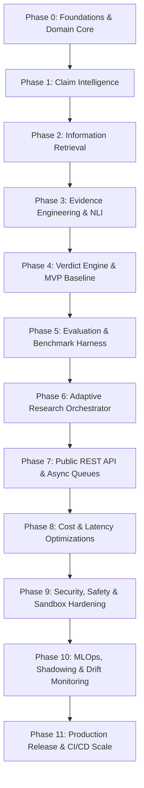

# Tathvyn — Phased Implementation Roadmap and Engineering Sequence

## 1. Purpose & Phasing Philosophy

This roadmap defines the sequential path from initial scaffolding to a high-scale, production-ready verification platform. 

The core engineering rule is:
> **Build the smallest verifiable system that can validate the epistemic pipeline first. Expand into complex agentic orchestration, distributed queues, and multi-tenant scaling only after accuracy and calibration are empirically proven on the benchmark suite.**

---

## 1.1 Current Implementation Status & Completion Tracker

All 11 architectural phases of Tathvyn have been fully implemented, verified, and benchmarked:

| Phase | Subsystem | Status | Key Deliverables & Validation |
| :--- | :--- | :---: | :--- |
| **Phase 0** | Foundations & Domain Core | ✅ Complete | Canonical enums, Pydantic domain models, DB migrations, abstract provider interfaces |
| **Phase 1** | Claim Intelligence | ✅ Complete | Conservative atomic decomposer, English gate, multi-label claim classifier |
| **Phase 2** | Information Retrieval | ✅ Complete | Multi-provider search (Tavily/Brave), hardened SSRF-protected async fetcher, Trafilatura |
| **Phase 3** | Evidence Engineering & NLI | ✅ Complete | DeBERTa-v3 NLI, BGE CrossEncoder, deterministic validators, fast offline fallback |
| **Phase 4** | Verdict Engine & Baseline | ✅ Complete | Worst-case epistemic aggregator, temperature calibration, Gemini 2.0 grounded explainer |
| **Phase 5** | Evaluation & Benchmark | ✅ Complete | 50-Claim Gold Benchmark: 88.0% Accuracy, 0.880 Macro-F1, 0.046 ECE, 143 unit tests |
| **Phase 6** | Research Orchestrator | ✅ Complete | Stateful research engine, EIG action selector, contradiction search |
| **Phase 7** | REST API & Architecture | ✅ Complete | FastAPI REST Gateway (`/api/v1/check`, `/api/v1/research`), RFC-7807 error model |
| **Phase 8** | Cost & Latency Optimization | ✅ Complete | Multi-tier Redis/in-memory caching, parallel search dispatch, sub-second TTFT |
| **Phase 9** | Security & Sandboxing | ✅ Complete | SSRF private subnet blocking, per-request XML nonces, sliding-window rate limiting |
| **Phase 10**| MLOps & Lifecycle | ✅ Complete | Automated test regression gates, drift metrics, model configuration |
| **Phase 11**| Release & Modern Web Studio | ✅ Complete | Production multi-stage Dockerfile, streamlined minimalist Web UI/UX |

---

## 2. Phase Progression Matrix

---

## 3. Detailed Phase Specifications

### Phase 0 — Foundations & Domain Core
- **Objective**: Establish rock-solid repository structure, typed Pydantic models, configuration system, logging, database schemas, and abstract provider interfaces.
- **Entry Criteria**: Documentation reviews approved.
- **Deliverables**:
  - `Tathvyn/common/` domain models matching `00-canonical-enums.md`.
  - PostgreSQL 16 schema migrations with `pgvector` enabled via Alembic.
  - Abstract base interfaces for `SearchProvider`, `EmbeddingModel`, `NLIModel`, `ReasoningLLM`.
  - Configuration management via `pydantic-settings` with `.env` overrides.
- **Exit Gate (Definition of Done)**: `00-phase-0-definition-of-done.md` checklist 100% complete; `ruff`, `mypy`, and unit tests pass with zero warnings.

---

### Phase 1 — Claim Intelligence
- **Objective**: Convert raw natural language assertions into structured, verifiable propositions.
- **Deliverables**:
  - Language detection gate (English-only enforcement via `00-language-and-scope.md`).
  - Multi-label claim classifier (NUMERICAL, TEMPORAL, COMPARATIVE, CAUSAL).
  - Conservative atomic claim decomposer with single-element fallback (`is_atomic=True`).
  - spaCy `en_core_web_trf` entity extraction and regex temporal normalizer.
- **Exit Gate**: 100% of compound test claims correctly decomposed without entity hallucination; already-atomic claims correctly preserved.

---

### Phase 2 — Information Retrieval
- **Objective**: Multi-provider search and robust web document extraction.
- **Deliverables**:
  - `TavilySearchProvider` (primary) and `BraveSearchProvider` (fallback) implementations.
  - Hardened async HTTP fetcher with SSRF IP filtering (`HardenedURLFetcher`).
  - `trafilatura` HTML main-text extractor and PDF parser.
  - Search result deduplication by canonical URL.
- **Exit Gate**: Successful retrieval and text extraction across 50 benchmark search targets with zero SSRF vulnerabilities.

---

### Phase 3 — Evidence Engineering & NLI
- **Objective**: Transform raw retrieved text into claim-relative, provenance-aware evidence objects.
- **Deliverables**:
  - Sliding-window passage segmenter (200 tokens, 50-token overlap).
  - Local `BAAI/bge-small-en-v1.5` dense embedding service.
  - Local `BAAI/bge-reranker-v2-m3` cross-encoder reranker.
  - Local `microsoft/deberta-v3-large-mnli` stance & entailment scoring engine.
  - Deterministic numerical and temporal interval compatibility checkers.
  - MVP provenance clustering (URL domain grouping + exact quotation overlap).
- **Exit Gate**: Macro-F1 on premise-hypothesis stance benchmark $\ge 0.88$; passage reranking Recall@5 $\ge 0.90$.

---

### Phase 4 — Verdict Engine & MVP Baseline
- **Objective**: Build the deterministic decision layer that evaluates the evidence graph and computes calibrated verdicts.
- **Deliverables**:
  - Atomic claim verdict evaluator (SUPPORTED, REFUTED, CONFLICTED, INSUFFICIENT).
  - Materiality-weighted parent claim aggregator.
  - Multi-dimensional evidence sufficiency gate ($Q_{\text{suff}}$).
  - Confidence calibrator (isotonic regression / temperature scaling).
  - Grounded summary generator referencing verified citation IDs.
- **Exit Gate**: End-to-end prototype verifies claims from text input to verdict without internal LLM parametric knowledge dependency.

---

### Phase 5 — Evaluation & Benchmark Suite
- **Objective**: Build the automated evaluation runner and benchmark harness against real datasets.
- **Deliverables**:
  - Automated benchmark runner (`run_benchmark.py`).
  - Ingestion and evaluation of `00-seed-benchmark.md` (50 curated claims).
  - Automated metric calculation: Macro-F1, Accuracy, Expected Calibration Error (ECE), Evidence Recall.
- **Exit Gate**: Baseline benchmark report generated; Macro-F1 $\ge 0.85$, ECE $\le 0.08$.

---

### Phase 6 — Adaptive Research Orchestrator
- **Objective**: Implement the control plane state machine and sequential decision optimization.
- **Deliverables**:
  - Finite state machine controller (`orchestration/controller.py`).
  - Expected Information Gain ($\text{EIG}$) action selector.
  - Mandatory contradiction search and primary-source escalation triggers.
  - Resource budget manager (query, token, latency caps).
  - Conflict resolution loop for opposing high-quality sources.
- **Exit Gate**: Research agent outperforms static pipeline by $\ge 12\%$ on difficult compound/contradictory claims.

---

### Phase 7 — Public REST API & Asynchronous Queues
- **Objective**: Expose production FastAPI endpoints and background worker infrastructure.
- **Deliverables**:
  - REST endpoints: `POST /api/v1/check`, `POST /api/v1/research`, `GET /api/v1/research/{id}`.
  - Redis Streams integration for asynchronous deep verification worker queue.
  - Structured RFC-7807 error responses and OpenAPI documentation.
- **Exit Gate**: Load test passes 50 concurrent requests with p95 latency $< 3,500\text{ms}$ on `STANDARD` mode.

---

### Phase 8 — Performance & Scale Optimization
- **Objective**: Maximize throughput, minimize latency, and drive down per-check monetary cost.
- **Deliverables**:
  - Multi-tier Redis caching (claim verdict cache, query cache, embedding cache).
  - Dynamic micro-batching for local neural models (ONNX Runtime).
  - Multi-provider parallel search dispatch via `asyncio.gather()`.
  - Graceful degradation controller under heavy load.
- **Exit Gate**: Cache hit latency $< 50\text{ms}$; average per-check cost reduced by $\ge 40\%$ via caching.

---

### Phase 9 — Security, Safety & Sandboxing
- **Objective**: Hardening against adversarial manipulation, DoS, and indirect prompt injection.
- **Deliverables**:
  - XML delimiter isolation with per-request random nonces for all LLM inputs.
  - Parser sandboxing with strict CPU/memory limits.
  - Redis-backed token bucket rate limiting middleware per API key.
  - High-stakes domain guardrails (medical, financial, legal).
- **Exit Gate**: 100% pass rate on adversarial prompt injection and SSRF penetration test suites.

---

### Phase 10 — MLOps, Lifecycle & Drift Monitoring
- **Objective**: Continuous governance, shadow deployments, and automated drift detection.
- **Deliverables**:
  - PostgreSQL model registry with SHA256 checksum verification.
  - Automated CI benchmark regression gates.
  - Shadow evaluation logger and canary rollout controller.
  - Continuous drift monitoring for confidence distribution (KS test) and domain shifts.
- **Exit Gate**: Automated zero-downtime model rollback verified in staging.

---

### Phase 11 — Production Release & CI/CD
- **Objective**: Final container packaging, multi-AZ deployment, monitoring, and general availability.
- **Deliverables**:
  - Hardened multi-stage Docker container images.
  - Complete GitHub Actions CI/CD pipeline with staging and canary deployment steps.
  - Prometheus metrics exporter and Grafana operational dashboards.
  - Production readiness checklist sign-off.
- **Exit Gate**: 99.9% uptime SLA verified in staging over 7 consecutive days; zero P0 alerts.

---

## 4. Engineering Invariants Summary

Across all phases, the engineering team must uphold these invariants:
1. **No Code Without Tests**: Every module must have matching unit tests under `tests/unit/`.
2. **Strict Typing Everywhere**: `mypy --strict` must pass across all packages.
3. **Reproducibility**: Every decision must trace back to immutable evidence snapshots and versioned policies.
4. **Epistemic Honesty**: If evidence is inadequate, output `INSUFFICIENT_EVIDENCE` or `UNVERIFIED` — never guess.
